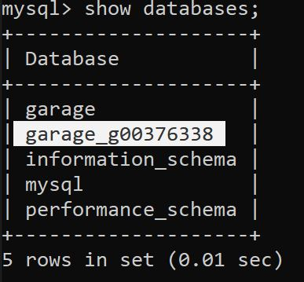
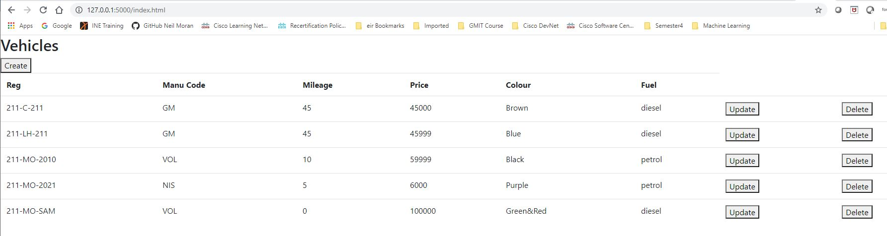

# Data Representation BIG PROJECT 2020

##### Course: HD in Data Analytics
##### Module: Data Representation and Querying
##### Module ID: 52957
##### Student Name: Neil Moran
##### Student ID: G00376338
##### Date: 5th January 2020

 

## Introduction

This project is the final project for Data Representation and Querying module. It is a Web Application that performs CRUD operations to a table in an SQL database. The project consists of the following files and folders:

  * **dbconfigTemplate.py** - This is Database connection detail as used in the dbconfig.py file
  * **vehicleDAO.py** - This is the Data Access Object python file to connect to the MySQL database
  * **restserver.py** - This is the Flask python program that maps https requests to individual functions
  * **/staticpages/index.html** - This is the HTML/JS code that the browser runs to send HTTP requests via Flash rest server 
  * **/garage_g00376338/** - This is the DB Import Files Folder containing two DB tables for importing
 
  
 
  The sections below will describe the following parts of the project
  
  * **Database Detail and Importing the Database** - This will describe the DB details and tables that the Web application is designed to perform CRUD operations.
  * **Web Application Running Procedure** - This sections provides the running procedure for the Web Application
  * **Web Interface User Procedure** - This section provides screenshots of the Web Application performing CRUD operations on the Database

 

## Database Detail and Importing the Database

The database can be imported in to MySQL or equivalent from the two sql files in the **garage_g00376338/** folder. The database has been given a unique name to ensure that it can be imported to another machine for testing. The database details are given below

* Database Name: **garage_g00376338**
* Tables in DB: **vehicle & manufacturer**

See image of database **garage_g00376338** detail

The tables in the database **garage_g00376338** are given below

The primary key of the **manufacturer** table manu_code is a foreign key in the **vehicle** table. see image below.

Finally the current entries in the **vehicle** table are given below.

 

## Web Application Running Procedure

To start the application perform the following steps.

1. From cmder of equivalent run the python config program **dbconfigTemplate.py** in the example below **dbconfig.py** is run

2. Run Data Access Object python program **vehicleDAO.py**

3. Run Flash Server program **restserver.py**

The Web application is now ready to perform CRUD operations on the database

 

## Web Interface User Procedure 

The following CRUD operations are described in this section

* **READ** - The data from table **vehicle** is accessed and displayed using a GET html request when the main page url http://127.0.0.1:5000/index.html is accessed through the Flask server. 
* **CREATE** - An entry is created when the button Create is pressed, the form is displayed to enter the vehicle details along with the Instructions on what to enter in each field on the form. When the button Create is pressed an AJAX call is made with the POST method to enter the JSON data to the database via the Python DAO.
* **UPDATE** - To Update an existing entry in the DB press Update button beside any vehicle. This populates a form with the existing details each detail can be changed except the reg which is the primary key. When the details on the form are changed press Update and an AJAX call using method PUT to modify the database via the Python DAO. The page has to be refreshed again to see the modified data
* **DELETE** - To delete an database entry simply press teh delete button beside the entry you wish to remove and an AJAX call is made with the DELETE method via the Python DAO.

### Starting Web Application and Reading in the Data.

To start the Web application browse to the following url http://127.0.0.1:5000/index.html (Assuming flask server is at default port 5000 on local machine). See image below all vehicles are listed from the **vehicle** table in **garage_g00376338** DB

### Creating a new entry in the Database.

### Updating an existing entry in the Database

### Deleting an entry in the Database

