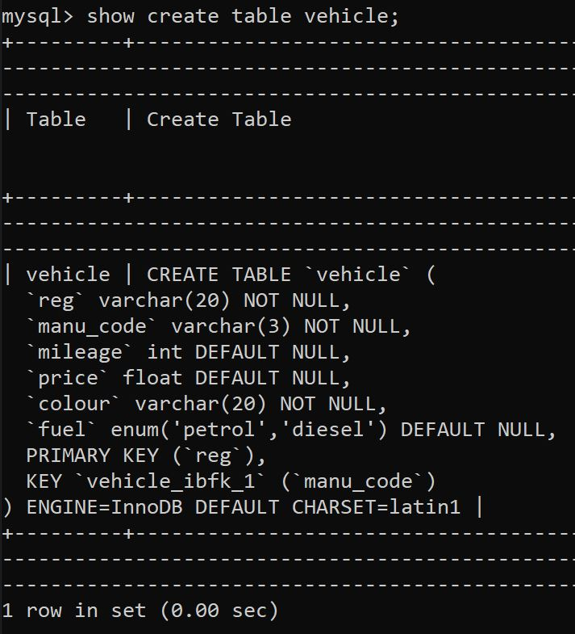

# Data Representation BIG PROJECT 2020

##### Course: HD in Data Analytics
##### Module: Data Representation and Querying
##### Module ID: 52957
##### Student Name: Neil Moran
##### Student ID: G00376338
##### Date: 5th January 2020

 

## Introduction

This project is the final project for Data Representation and Querying module. It is a Web Application that performs CRUD operations to a table in an SQL database. The project consists of the following files and folders:

  * dbconfigTemplate.py - This is Database connection detail as used in the dbconfig.py file
  * vehicleDAO.py - This is the Data Access Object python file to connect to the MySQL database
  * restserver.py - This is the Flask python program that maps https requests to individual functions
  * /staticpages/index.html - This is the HTML/JS code that the browser runs to send HTTP requests via Flash rest server 
  * /garage_g00376338/ - This is the DB Import Files Folder containing two DB tables for importing
  
  The sections below will describe the following parts of the project
  
  * Database Detail and Importing the Database - This will describe the DB details and tables that the Web application is designed to perform CRUD operations.
  * Web Application Running Procedure - This sections provides the running procedure for the Web Application
  * Web Interface User Procedure - This section provides screenshots of the Web Application performing CRUD operations on the Database

## Database Detail and Importing the Database

The database can be imported in to MySQL or equivalent from the two sql files in the garage_g00376338/ folder. The database has been given a unique name to ensure that it can be imported to another machine for testing. The database details are given below

* Database Name: garage_g00376338
* Tables in DB: vehicle & manufacturer

See image of database garage_g00376338 detail

The tables in the database garage_g00376338 are given below

The primary key of the manufacturer table manu_code is a foreign key in the vehicle table. see image below.

Finally the current entries in the vehicle table are given below.

## Web Application Running Procedure

To start the application perform the following steps.

1. From cmder of equivalent run the python config program dbconfigTemplate.py in the example below dbconfig.py is run

2. Run Data Access Object python program vehicleDAO.py 

3. Run Flash Server 

The Web application is now ready to perform CRUD operations on the database

## Web Interface User Procedure 
